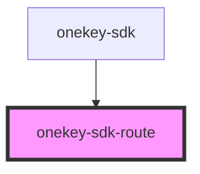

# onekey-sdk-route

<!-- Auto Generated Below -->

## Properties

| Property    | Attribute   | Description | Type     | Default     |
| ----------- | ----------- | ----------- | -------- | ----------- |
| `component` | `component` |             | `string` | `undefined` |
| `path`      | `path`      |             | `string` | `undefined` |

## Dependencies

### Used by

 - [onekey-sdk](../../screens/onekey-sdk)

### Graph

----------------------------------------------

*Built with [StencilJS](https://stenciljs.com/)*
