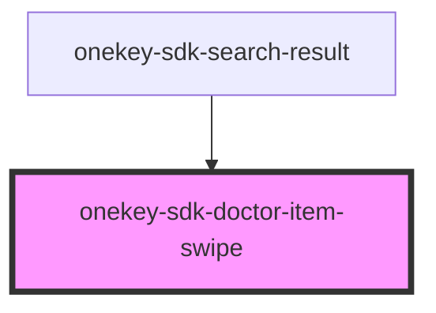

# onekey-sdk-doctor-item-swipe

<!-- Auto Generated Below -->

## Properties

| Property   | Attribute  | Description | Type     | Default     |
| ---------- | ---------- | ----------- | -------- | ----------- |
| `address`  | `address`  |             | `string` | `undefined` |
| `distance` | `distance` |             | `string` | `undefined` |
| `gp`       | `gp`       |             | `string` | `undefined` |
| `name`     | `name`     |             | `string` | `undefined` |

## Dependencies

### Used by

 - [onekey-sdk-search-result](../../screens/onekey-sdk-search-result)

### Graph

----------------------------------------------

*Built with [StencilJS](https://stenciljs.com/)*
