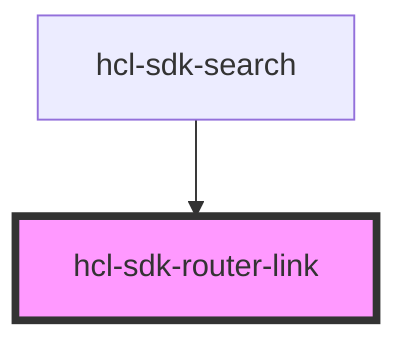

# hcl-sdk-router-link

<!-- Auto Generated Below -->

## Properties

| Property         | Attribute          | Description | Type     | Default         |
| ---------------- | ------------------ | ----------- | -------- | --------------- |
| `activeClass`    | `active-class`     |             | `string` | `'link-active'` |
| `anchorClass`    | `anchor-class`     |             | `string` | `undefined`     |
| `anchorId`       | `anchor-id`        |             | `string` | `undefined`     |
| `anchorRole`     | `anchor-role`      |             | `string` | `undefined`     |
| `anchorTabIndex` | `anchor-tab-index` |             | `string` | `undefined`     |
| `anchorTitle`    | `anchor-title`     |             | `string` | `undefined`     |
| `ariaHaspopup`   | `aria-haspopup`    |             | `string` | `undefined`     |
| `ariaLabel`      | `aria-label`       |             | `string` | `undefined`     |
| `ariaPosinset`   | `aria-posinset`    |             | `string` | `undefined`     |
| `ariaSetsize`    | `aria-setsize`     |             | `number` | `undefined`     |
| `custom`         | `custom`           |             | `string` | `'a'`           |
| `url`            | `url`              |             | `string` | `undefined`     |

## Dependencies

### Used by

 - [hcl-sdk-search](../../screens/hcl-sdk-search)

### Graph

----------------------------------------------

*Built with [StencilJS](https://stenciljs.com/)*
