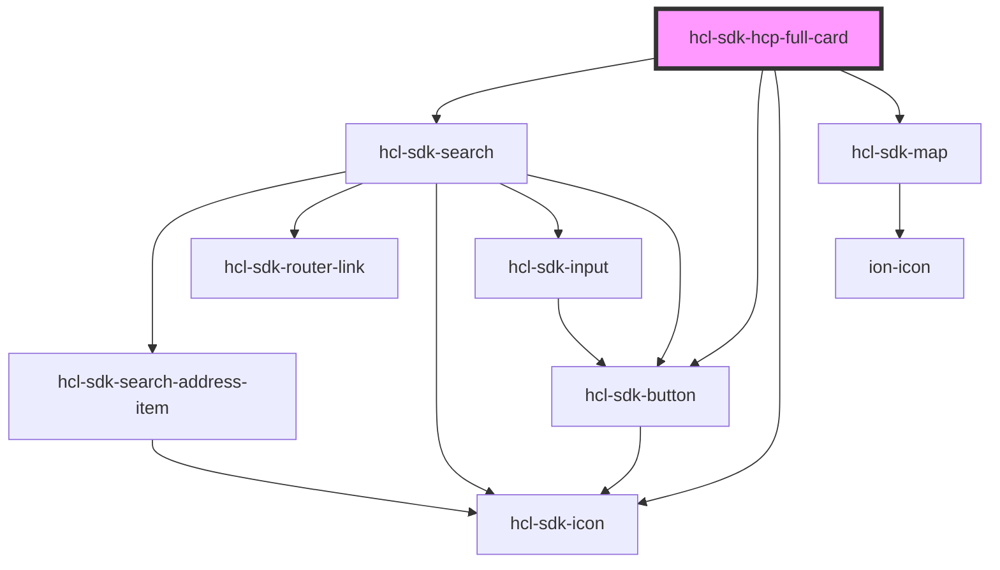

# hcl-sdk-hcp-full-card

<!-- Auto Generated Below -->

## Dependencies

### Depends on

- [hcl-sdk-search](../hcl-sdk-search)
- [hcl-sdk-button](../../ui-kits/hcl-sdk-button)
- [hcl-sdk-icon](../../ui-kits/hcl-sdk-icon)
- [hcl-sdk-map](../../ui-kits/hcl-sdk-map)

### Graph

----------------------------------------------

*Built with [StencilJS](https://stenciljs.com/)*
