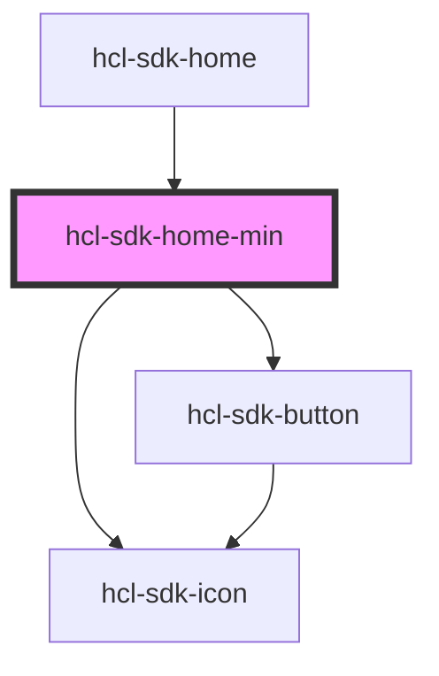

# hcl-sdk-home-min

<!-- Auto Generated Below -->

## Events

| Event            | Description | Type               |
| ---------------- | ----------- | ------------------ |
| `goSearchScreen` |             | `CustomEvent<any>` |

## Dependencies

### Used by

 - [hcl-sdk-home](..)

### Depends on

- [hcl-sdk-icon](../../../ui-kits/hcl-sdk-icon)
- [hcl-sdk-button](../../../ui-kits/hcl-sdk-button)

### Graph

----------------------------------------------

*Built with [StencilJS](https://stenciljs.com/)*
