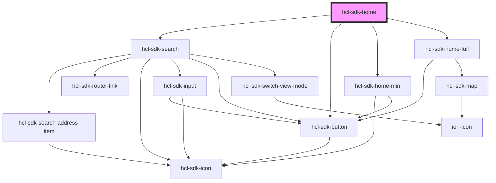

# hcl-sdk-home

<!-- Auto Generated Below -->

## Dependencies

### Depends on

- [hcl-sdk-search](../hcl-sdk-search)
- [hcl-sdk-button](../../ui-kits/hcl-sdk-button)
- [hcl-sdk-home-min](hcl-sdk-home-min)
- [hcl-sdk-home-full](hcl-sdk-home-full)

### Graph

----------------------------------------------

*Built with [StencilJS](https://stenciljs.com/)*
