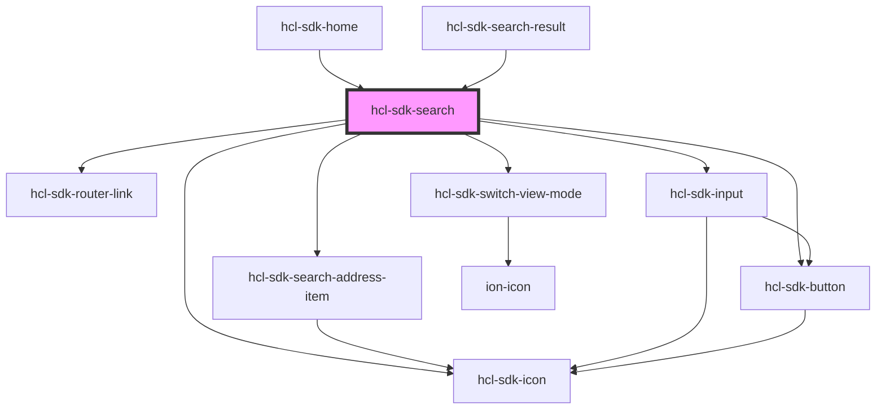

# hcl-sdk-search

<!-- Auto Generated Below -->

## Properties

| Property         | Attribute          | Description | Type      | Default     |
| ---------------- | ------------------ | ----------- | --------- | ----------- |
| `noIcon`         | `no-icon`          |             | `boolean` | `undefined` |
| `searchText`     | `search-text`      |             | `string`  | `undefined` |
| `showSwitchMode` | `show-switch-mode` |             | `boolean` | `false`     |

## Dependencies

### Used by

 - [hcl-sdk-home](../hcl-sdk-home)
 - [hcl-sdk-search-result](../hcl-sdk-search-result)

### Depends on

- [hcl-sdk-search-address-item](../../ui-kits/hcl-sdk-search-address-item)
- [hcl-sdk-router-link](../../hcl-sdk-router/hcl-sdk-router-link)
- [hcl-sdk-icon](../../ui-kits/hcl-sdk-icon)
- [hcl-sdk-input](../../ui-kits/hcl-sdk-input)
- [hcl-sdk-button](../../ui-kits/hcl-sdk-button)
- [hcl-sdk-switch-view-mode](../../ui-kits/hcl-sdk-switch-view-mode)

### Graph

----------------------------------------------

*Built with [StencilJS](https://stenciljs.com/)*
