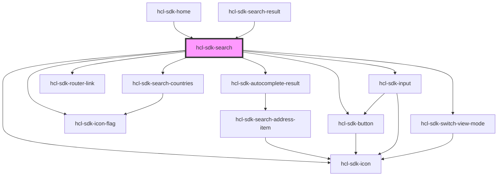

# hcl-sdk-search

<!-- Auto Generated Below -->

## Properties

| Property         | Attribute          | Description | Type      | Default     |
| ---------------- | ------------------ | ----------- | --------- | ----------- |
| `isSearchResult` | `is-search-result` |             | `boolean` | `false`     |
| `noIcon`         | `no-icon`          |             | `boolean` | `undefined` |

## Dependencies

### Used by

 - [hcl-sdk-home](../hcl-sdk-home)
 - [hcl-sdk-search-result](../hcl-sdk-search-result)

### Depends on

- [hcl-sdk-autocomplete-result](.)
- [hcl-sdk-search-countries](../../ui-kits/hcl-sdk-search-countries)
- [hcl-sdk-router-link](../../hcl-sdk-router/hcl-sdk-router-link)
- [hcl-sdk-icon](../../ui-kits/hcl-sdk-icon)
- [hcl-sdk-button](../../ui-kits/hcl-sdk-button)
- [hcl-sdk-input](../../ui-kits/hcl-sdk-input)
- [hcl-sdk-icon-flag](../../ui-kits/hcl-sdk-icon-flag)
- [hcl-sdk-switch-view-mode](../../ui-kits/hcl-sdk-switch-view-mode)

### Graph

----------------------------------------------

*Built with [StencilJS](https://stenciljs.com/)*
