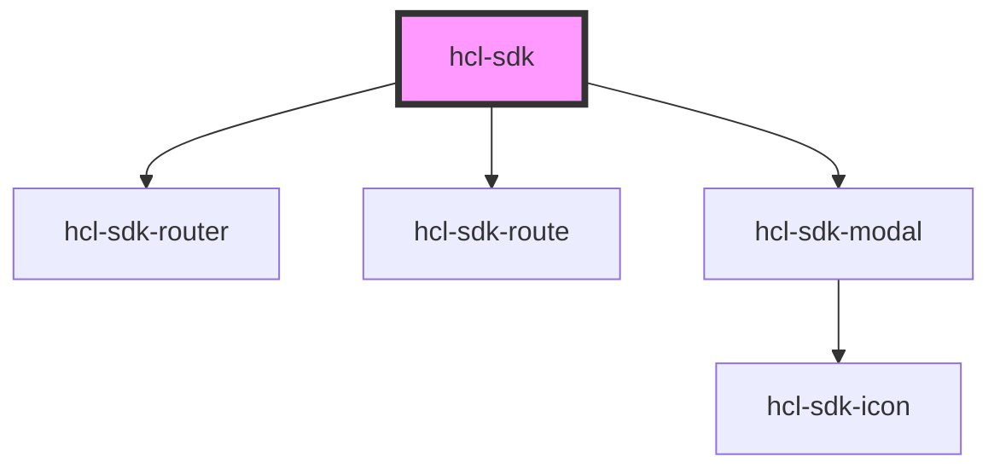

# hcl-sdk

<!-- Auto Generated Below -->

## Methods

### `init(config?: any) => Promise<void>`

#### Returns

Type: `Promise<void>`

### `searchNearMe({ specialtyCode }: { specialtyCode: any; }) => Promise<void>`

#### Returns

Type: `Promise<void>`

### `updateConfig(patch: any) => Promise<import("/Users/cong-luc.tran/Desktop/azure/onekey-sdk-web-lib/packages/hcl-sdk-web-ui/src/core/stores/ConfigStore").HclSDKConfigData>`

#### Returns

Type: `Promise<HclSDKConfigData>`

## Dependencies

### Depends on

- [hcl-sdk-router](../../hcl-sdk-router)
- [hcl-sdk-route](../../hcl-sdk-router/hcl-sdk-route)
- [hcl-sdk-modal](../../ui-kits/hcl-sdk-modal)

### Graph

----------------------------------------------

*Built with [StencilJS](https://stenciljs.com/)*
