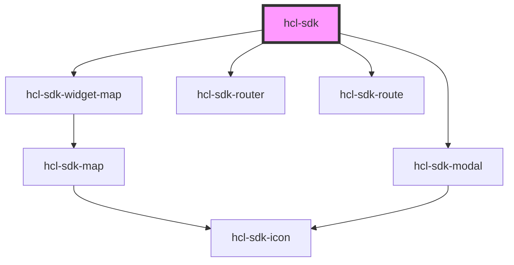

# hcl-sdk

<!-- Auto Generated Below -->

## Properties

| Property          | Attribute     | Description | Type                            | Default     |
| ----------------- | ------------- | ----------- | ------------------------------- | ----------- |
| `currentPosition` | --            |             | `{ lat: number; lng: number; }` | `undefined` |
| `initScreen`      | `init-screen` |             | `"home" \| "search"`            | `undefined` |
| `widget`          | `widget`      |             | `"map"`                         | `undefined` |
| `widgetProps`     | --            |             | `WidgetMap`                     | `undefined` |

## Methods

### `backToHome() => Promise<void>`

#### Returns

Type: `Promise<void>`

### `init({ isShowcase, getCurrentPosition, ...config }?: any) => Promise<void>`

#### Returns

Type: `Promise<void>`

### `searchNearMe({ specialtyCode, specialtyLabel }: { specialtyCode: string[]; specialtyLabel: string; }) => Promise<void>`

#### Returns

Type: `Promise<void>`

### `updateConfig(patch: any) => Promise<HclSDKConfigData>`

#### Returns

Type: `Promise<HclSDKConfigData>`

## Dependencies

### Depends on

- [hcl-sdk-widget-map](../../widgets/hcl-sdk-widget-map)
- [hcl-sdk-router](../../hcl-sdk-router)
- [hcl-sdk-route](../../hcl-sdk-router/hcl-sdk-route)
- [hcl-sdk-modal](../../ui-kits/hcl-sdk-modal)

### Graph

----------------------------------------------

*Built with [StencilJS](https://stenciljs.com/)*
