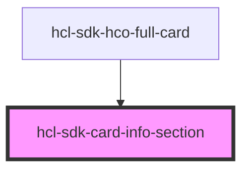

# hcl-sdk-card-info-section

<!-- Auto Generated Below -->

## Properties

| Property | Attribute | Description | Type     | Default     |
| -------- | --------- | ----------- | -------- | ----------- |
| `header` | `header`  |             | `any`    | `undefined` |
| `map`    | `map`     |             | `any`    | `undefined` |
| `title`  | `title`   |             | `string` | `undefined` |

## Dependencies

### Used by

 - [hcl-sdk-hco-full-card](../hcl-sdk-hco-full-card)

### Graph

----------------------------------------------

*Built with [StencilJS](https://stenciljs.com/)*
