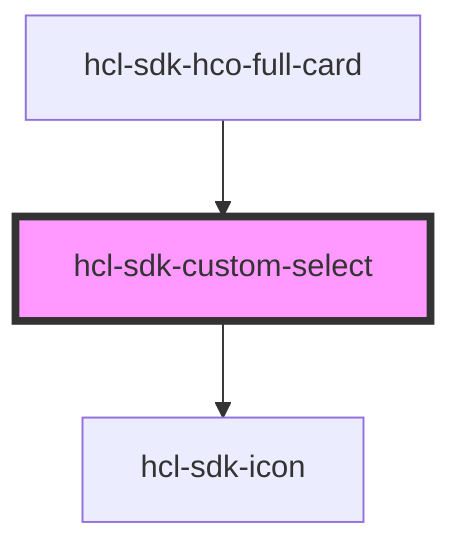

# hcl-sdk-custom-select

<!-- Auto Generated Below -->

## Properties

| Property           | Attribute            | Description | Type               | Default     |
| ------------------ | -------------------- | ----------- | ------------------ | ----------- |
| `allowEmpty`       | `allow-empty`        |             | `boolean`          | `undefined` |
| `defaultValue`     | `default-value`      |             | `string`           | `undefined` |
| `isLoadingService` | `is-loading-service` |             | `boolean`          | `undefined` |
| `level`            | `level`              |             | `number`           | `undefined` |
| `loadMoreOptions`  | --                   |             | `(e: any) => void` | `undefined` |
| `name`             | `name`               |             | `string`           | `undefined` |
| `onChange`         | --                   |             | `(e: any) => void` | `undefined` |
| `options`          | --                   |             | `OptionType[]`     | `undefined` |
| `value`            | `value`              |             | `string`           | `undefined` |

## Events

| Event            | Description | Type               |
| ---------------- | ----------- | ------------------ |
| `loadMoreOption` |             | `CustomEvent<any>` |
| `selectService`  |             | `CustomEvent<any>` |

## Dependencies

### Used by

 - [hcl-sdk-hco-full-card](../hcl-sdk-hco-full-card)

### Depends on

- [hcl-sdk-icon](../hcl-sdk-icon)

### Graph

----------------------------------------------

*Built with [StencilJS](https://stenciljs.com/)*
