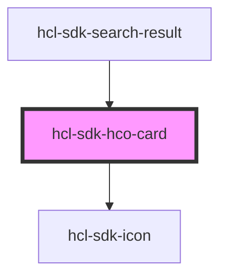

# hcl-sdk-hco-card

<!-- Auto Generated Below -->

## Properties

| Property       | Attribute       | Description | Type      | Default                              |
| -------------- | --------------- | ----------- | --------- | ------------------------------------ |
| `address`      | `address`       |             | `string`  | `'2 Rue Ambroise Paré, 75010 Paris'` |
| `distance`     | `distance`      |             | `string`  | `'82m'`                              |
| `name`         | `name`          |             | `string`  | `undefined`                          |
| `selected`     | `selected`      |             | `boolean` | `undefined`                          |
| `showDistance` | `show-distance` |             | `boolean` | `true`                               |
| `type`         | `type`          |             | `string`  | `'Hospital'`                         |
| `viewMode`     | `view-mode`     |             | `string`  | `undefined`                          |

## Dependencies

### Used by

 - [hcl-sdk-search-result](../../screens/hcl-sdk-search-result)

### Depends on

- [hcl-sdk-icon](../hcl-sdk-icon)

### Graph

----------------------------------------------

*Built with [StencilJS](https://stenciljs.com/)*
