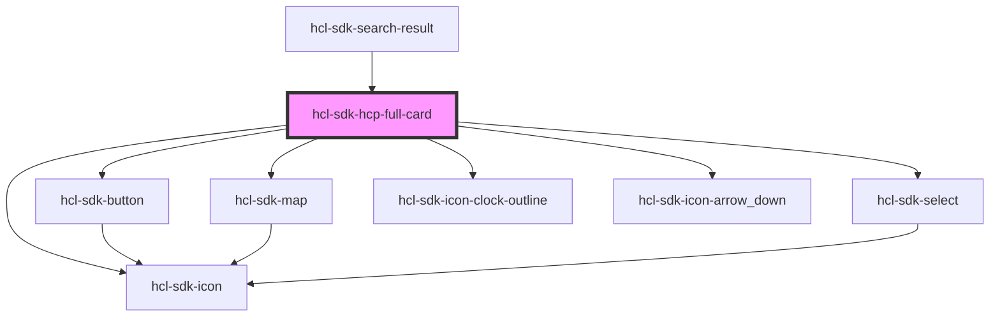

# hcl-sdk-hcp-full-card

<!-- Auto Generated Below -->

## Events

| Event              | Description | Type                      |
| ------------------ | ----------- | ------------------------- |
| `backFromFullCard` |             | `CustomEvent<MouseEvent>` |

## Dependencies

### Used by

 - [hcl-sdk-search-result](../../screens/hcl-sdk-search-result)

### Depends on

- [hcl-sdk-button](../hcl-sdk-button)
- [hcl-sdk-icon](../hcl-sdk-icon)
- [hcl-sdk-map](../hcl-sdk-map)
- [hcl-sdk-select](../hcl-sdk-select)
- [hcl-sdk-icon-clock-outline](../hcl-sdk-icon/icons)
- [hcl-sdk-icon-arrow_down](../hcl-sdk-icon/icons)

### Graph

----------------------------------------------

*Built with [StencilJS](https://stenciljs.com/)*
