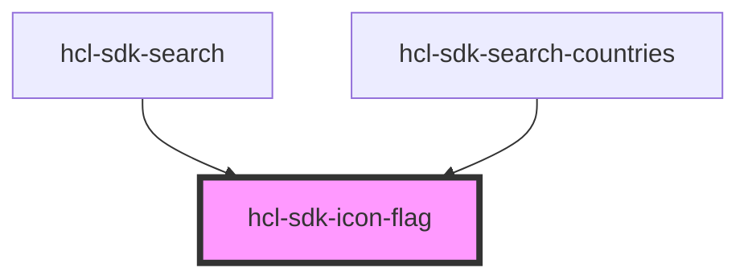

# hcl-sdk-icon-flag

<!-- Auto Generated Below -->

## Properties

| Property      | Attribute      | Description | Type                                                                                                                                                                                   | Default     |
| ------------- | -------------- | ----------- | -------------------------------------------------------------------------------------------------------------------------------------------------------------------------------------- | ----------- |
| `countryCode` | `country-code` |             | `"BE" \| "CA" \| "CO" \| "DE" \| "ES" \| "FR" \| "GB" \| "UK" \| "IT" \| "NL" \| "PL" \| "PT" \| "SA" \| "US" \| "AU" \| "AT" \| "HR" \| "GR" \| "IL" \| "MA" \| "SE" \| "CH" \| "TH"` | `undefined` |

## Dependencies

### Used by

 - [hcl-sdk-search](../../screens/hcl-sdk-search)
 - [hcl-sdk-search-countries](../hcl-sdk-search-countries)

### Graph

----------------------------------------------

*Built with [StencilJS](https://stenciljs.com/)*
