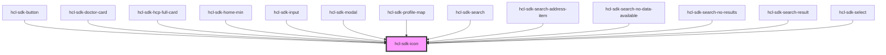

# hcl-sdk-icon

<!-- Auto Generated Below -->

## Properties

| Property  | Attribute | Description | Type      | Default     |
| --------- | --------- | ----------- | --------- | ----------- |
| `color`   | `color`   |             | `string`  | `undefined` |
| `height`  | `height`  |             | `number`  | `20`        |
| `name`    | `name`    |             | `string`  | `undefined` |
| `primary` | `primary` |             | `boolean` | `false`     |
| `width`   | `width`   |             | `number`  | `20`        |

## Dependencies

### Used by

 - [hcl-sdk-button](../hcl-sdk-button)
 - [hcl-sdk-doctor-card](../hcl-sdk-doctor-card)
 - [hcl-sdk-hcp-full-card](../hcl-sdk-hcp-full-card)
 - [hcl-sdk-home-min](../../screens/hcl-sdk-home/hcl-sdk-home-min)
 - [hcl-sdk-input](../hcl-sdk-input)
 - [hcl-sdk-modal](../hcl-sdk-modal)
 - [hcl-sdk-profile-map](../hcl-sdk-profile-map)
 - [hcl-sdk-search](../../screens/hcl-sdk-search)
 - [hcl-sdk-search-address-item](../hcl-sdk-search-address-item)
 - [hcl-sdk-search-no-data-available](../hcl-sdk-search-no-data-available)
 - [hcl-sdk-search-no-results](../hcl-sdk-search-no-results)
 - [hcl-sdk-search-result](../../screens/hcl-sdk-search-result)
 - [hcl-sdk-select](../hcl-sdk-select)

### Graph

----------------------------------------------

*Built with [StencilJS](https://stenciljs.com/)*
