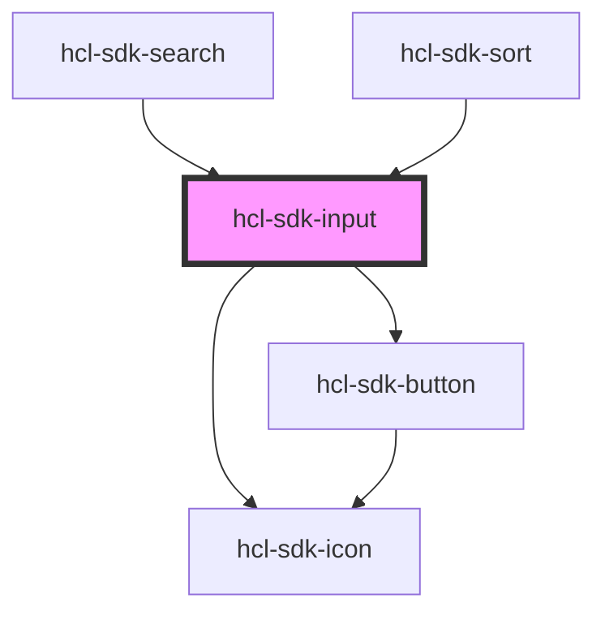

# hcl-sdk-input

<!-- Auto Generated Below -->

## Properties

| Property         | Attribute       | Description | Type               | Default     |
| ---------------- | --------------- | ----------- | ------------------ | ----------- |
| `autoComplete`   | `auto-complete` |             | `string`           | `undefined` |
| `autoFocus`      | `auto-focus`    |             | `boolean`          | `false`     |
| `checked`        | `checked`       |             | `boolean`          | `false`     |
| `class`          | `class`         |             | `string`           | `undefined` |
| `loading`        | `loading`       |             | `boolean`          | `false`     |
| `name`           | `name`          |             | `string`           | `undefined` |
| `onBlur`         | --              |             | `(e: any) => void` | `undefined` |
| `onFocus`        | --              |             | `(e: any) => void` | `undefined` |
| `onInput`        | --              |             | `(e: any) => void` | `undefined` |
| `onPostfixClick` | --              |             | `(e: any) => void` | `undefined` |
| `placeholder`    | `placeholder`   |             | `string`           | `undefined` |
| `postfixIcon`    | `postfix-icon`  |             | `string`           | `undefined` |
| `readOnly`       | `read-only`     |             | `boolean`          | `false`     |
| `type`           | `type`          |             | `string`           | `"text"`    |
| `value`          | `value`         |             | `any`              | `undefined` |

## Dependencies

### Used by

 - [hcl-sdk-search](../../screens/hcl-sdk-search)
 - [hcl-sdk-sort](../hcl-sdk-sort)

### Depends on

- [hcl-sdk-button](../hcl-sdk-button)
- [hcl-sdk-icon](../hcl-sdk-icon)

### Graph

----------------------------------------------

*Built with [StencilJS](https://stenciljs.com/)*
