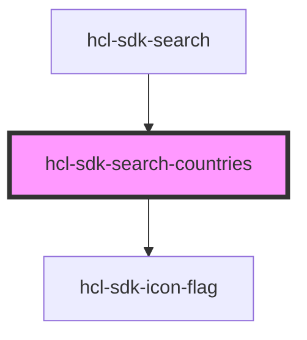

# hcl-sdk-search-countries

<!-- Auto Generated Below -->

## Properties

| Property               | Attribute                | Description | Type                                                                                                                               | Default     |
| ---------------------- | ------------------------ | ----------- | ---------------------------------------------------------------------------------------------------------------------------------- | ----------- |
| `currentSelectedInput` | `current-selected-input` |             | `"address" \| "country" \| "medicalTerm" \| "name" \| "specialtyName"`                                                             | `undefined` |
| `data`                 | --                       |             | `{ code: "BE" \| "CA" \| "CO" \| "DE" \| "ES" \| "FR" \| "GB" \| "IT" \| "NL" \| "PL" \| "PT" \| "SA" \| "US"; label: string; }[]` | `undefined` |
| `selectedCountry`      | `selected-country`       |             | `"BE" \| "CA" \| "CO" \| "DE" \| "ES" \| "FR" \| "GB" \| "IT" \| "NL" \| "PL" \| "PT" \| "SA" \| "US"`                             | `undefined` |

## Events

| Event           | Description | Type               |
| --------------- | ----------- | ------------------ |
| `selectCountry` |             | `CustomEvent<any>` |

## Dependencies

### Used by

 - [hcl-sdk-search](../../screens/hcl-sdk-search)

### Depends on

- [hcl-sdk-icon-flag](../hcl-sdk-icon-flag)

### Graph

----------------------------------------------

*Built with [StencilJS](https://stenciljs.com/)*
