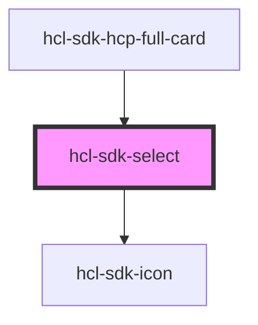

# hcl-sdk-select

<!-- Auto Generated Below -->

## Properties

| Property   | Attribute | Description | Type               | Default     |
| ---------- | --------- | ----------- | ------------------ | ----------- |
| `loading`  | `loading` |             | `boolean`          | `undefined` |
| `onChange` | --        |             | `(e: any) => void` | `undefined` |
| `options`  | --        |             | `OptionType[]`     | `undefined` |
| `value`    | `value`   |             | `string`           | `undefined` |

## Dependencies

### Used by

 - [hcl-sdk-hcp-full-card](../hcl-sdk-hcp-full-card)

### Depends on

- [hcl-sdk-icon](../hcl-sdk-icon)

### Graph

----------------------------------------------

*Built with [StencilJS](https://stenciljs.com/)*
