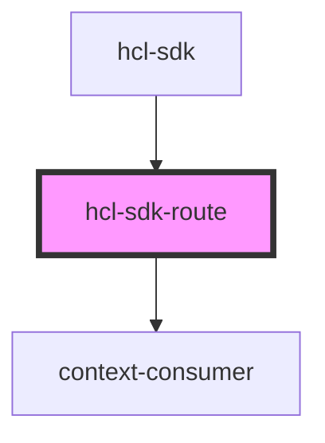

# hcl-sdk-route

<!-- Auto Generated Below -->

## Properties

| Property         | Attribute         | Description | Type         | Default     |
| ---------------- | ----------------- | ----------- | ------------ | ----------- |
| `activatedRoute` | `activated-route` |             | `string`     | `undefined` |
| `component`      | `component`       |             | `string`     | `undefined` |
| `path`           | `path`            |             | `string`     | `undefined` |
| `store`          | --                |             | `StoreProps` | `undefined` |

## Dependencies

### Used by

 - [hcl-sdk](../../screens/hcl-sdk)

### Depends on

- context-consumer

### Graph

----------------------------------------------

*Built with [StencilJS](https://stenciljs.com/)*
