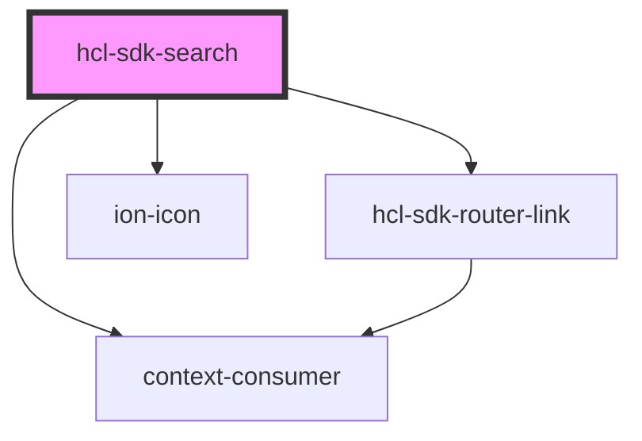

# hcl-sdk-search

<!-- Auto Generated Below -->

## Properties

| Property            | Attribute             | Description | Type  | Default     |
| ------------------- | --------------------- | ----------- | ----- | ----------- |
| `setActivatedRoute` | `set-activated-route` |             | `any` | `undefined` |
| `setStore`          | `set-store`           |             | `any` | `undefined` |
| `store`             | `store`               |             | `any` | `undefined` |

## Dependencies

### Depends on

- [hcl-sdk-router-link](../../hcl-sdk-router/hcl-sdk-router-link)
- ion-icon
- context-consumer

### Graph

----------------------------------------------

*Built with [StencilJS](https://stenciljs.com/)*
