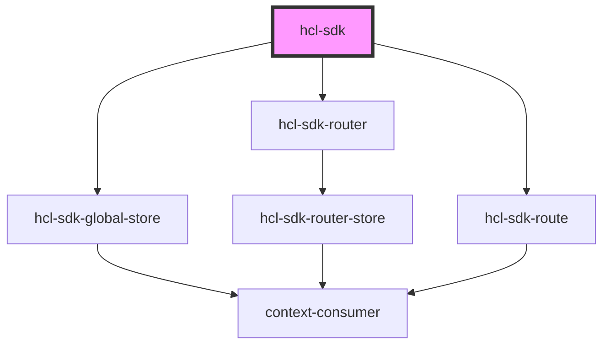

# hcl-sdk

<!-- Auto Generated Below -->

## Properties

| Property | Attribute | Description | Type                  | Default     |
| -------- | --------- | ----------- | --------------------- | ----------- |
| `config` | --        |             | `HclSDKConfigData` | `undefined` |

## Dependencies

### Depends on

- [hcl-sdk-global-store](../../hcl-sdk-store)
- [hcl-sdk-router](../../hcl-sdk-router)
- [hcl-sdk-route](../../hcl-sdk-router/hcl-sdk-route)

### Graph

----------------------------------------------

*Built with [StencilJS](https://stenciljs.com/)*
