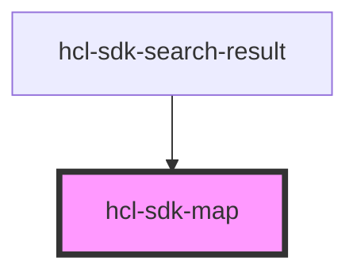

# hcl-sdk-map

<!-- Auto Generated Below -->

## Properties

| Property                    | Attribute                      | Description           | Type     | Default                                                  |
| --------------------------- | ------------------------------ | --------------------- | -------- | -------------------------------------------------------- |
| `defaultZoom`               | `default-zoom`                 |                       | `number` | `10`                                                     |
| `locations`                 | --                             |                       | `any[]`  | `[]`                                                     |
| `mapHeight`                 | `map-height`                   | An array of locations | `string` | `'100%'`                                                 |
| `mapLink`                   | `map-link`                     |                       | `string` | `'<a href="http://openstreetmap.org">OpenStreetMap</a>'` |
| `mapTileLayer`              | `map-tile-layer`               |                       | `string` | `'http://a.tile.openstreetmap.fr/hot/{z}/{x}/{y}.png'`   |
| `mapWidth`                  | `map-width`                    |                       | `string` | `'100%'`                                                 |
| `markerIcon`                | `marker-icon`                  |                       | `string` | `undefined`                                              |
| `markerIconCurrentLocation` | `marker-icon-current-location` |                       | `string` | `undefined`                                              |
| `selectedLocationIdx`       | `selected-location-idx`        |                       | `number` | `0`                                                      |

## Dependencies

### Used by

 - [hcl-sdk-search-result](../../screens/hcl-sdk-search-result)

### Graph

----------------------------------------------

*Built with [StencilJS](https://stenciljs.com/)*
