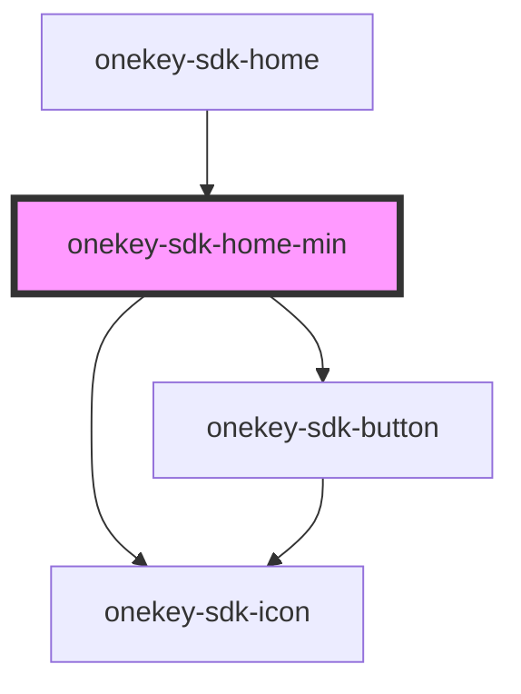

# onekey-sdk-home-min

<!-- Auto Generated Below -->

## Properties

| Property           | Attribute             | Description | Type  | Default     |
| ------------------ | --------------------- | ----------- | ----- | ----------- |
| `onGoSearchScreen` | `on-go-search-screen` |             | `any` | `undefined` |

## Dependencies

### Used by

 - [onekey-sdk-home](..)

### Depends on

- [onekey-sdk-icon](../../../ui-kits/onekey-sdk-icon)
- [onekey-sdk-button](../../../ui-kits/onekey-sdk-button)

### Graph

----------------------------------------------

*Built with [StencilJS](https://stenciljs.com/)*
