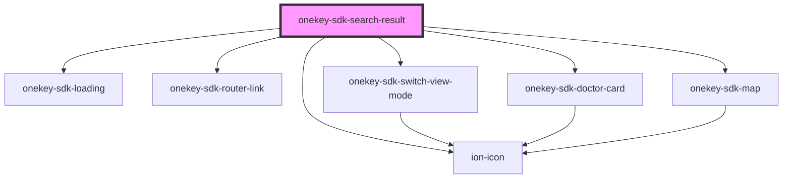

# onekey-sdk-search-doctor

<!-- Auto Generated Below -->

## Dependencies

### Depends on

- [onekey-sdk-loading](../../ui-kits/onekey-sdk-loading)
- [onekey-sdk-router-link](../../onekey-sdk-router/onekey-sdk-router-link)
- ion-icon
- [onekey-sdk-switch-view-mode](../../ui-kits/onekey-sdk-switch-view-mode)
- [onekey-sdk-doctor-card](../../ui-kits/onekey-sdk-doctor-card)
- [onekey-sdk-map](../../ui-kits/onekey-sdk-map)

### Graph

----------------------------------------------

*Built with [StencilJS](https://stenciljs.com/)*
