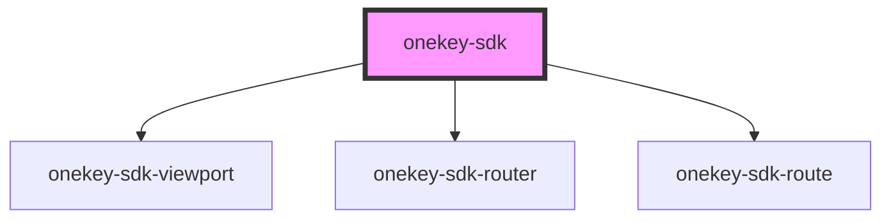

# onekey-sdk

<!-- Auto Generated Below -->

## Properties

| Property | Attribute | Description | Type                  | Default     |
| -------- | --------- | ----------- | --------------------- | ----------- |
| `config` | --        |             | `OneKeySDKConfigData` | `undefined` |

## Methods

### `updateConfig(patch: any) => Promise<OneKeySDKConfigData>`

#### Returns

Type: `Promise<OneKeySDKConfigData>`

## Dependencies

### Depends on

- [onekey-sdk-viewport](../../ui-kits/onekey-sdk-viewport)
- [onekey-sdk-router](../../onekey-sdk-router)
- [onekey-sdk-route](../../onekey-sdk-router/onekey-sdk-route)

### Graph

----------------------------------------------

*Built with [StencilJS](https://stenciljs.com/)*
