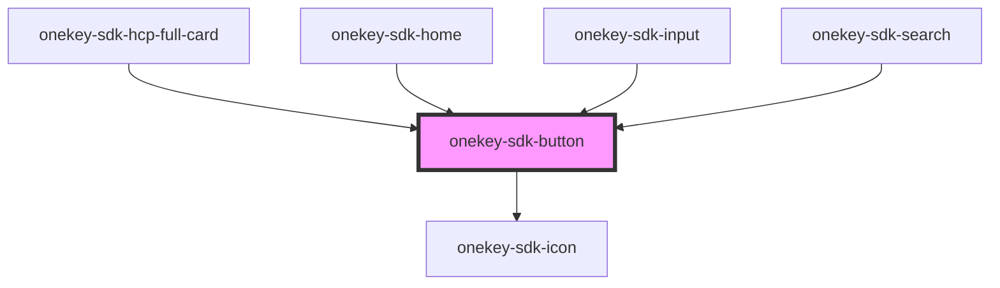

# onekey-sdk-button

<!-- Auto Generated Below -->

## Properties

| Property       | Attribute       | Description | Type      | Default     |
| -------------- | --------------- | ----------- | --------- | ----------- |
| `class`        | `class`         |             | `string`  | `undefined` |
| `disabled`     | `disabled`      |             | `boolean` | `undefined` |
| `icon`         | `icon`          |             | `string`  | `undefined` |
| `iconColor`    | `icon-color`    |             | `string`  | `undefined` |
| `isFull`       | `is-full`       |             | `boolean` | `undefined` |
| `noBackground` | `no-background` |             | `boolean` | `undefined` |
| `noBorder`     | `no-border`     |             | `boolean` | `undefined` |
| `noTextColor`  | `no-text-color` |             | `boolean` | `undefined` |
| `primary`      | `primary`       |             | `boolean` | `undefined` |
| `round`        | `round`         |             | `boolean` | `undefined` |
| `secondary`    | `secondary`     |             | `boolean` | `undefined` |

## Dependencies

### Used by

 - [onekey-sdk-hcp-full-card](../../screens/onekey-sdk-hcp-full-card)
 - [onekey-sdk-home](../../screens/onekey-sdk-home)
 - [onekey-sdk-input](../onekey-sdk-input)
 - [onekey-sdk-search](../../screens/onekey-sdk-search)

### Depends on

- [onekey-sdk-icon](../onekey-sdk-icon)

### Graph

----------------------------------------------

*Built with [StencilJS](https://stenciljs.com/)*
