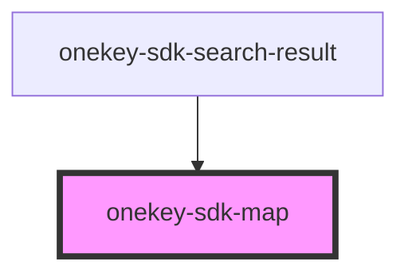

# onekey-sdk-map

<!-- Auto Generated Below -->

## Properties

| Property                    | Attribute                      | Description           | Type       | Default     |
| --------------------------- | ------------------------------ | --------------------- | ---------- | ----------- |
| `defaultZoom`               | `default-zoom`                 |                       | `number`   | `undefined` |
| `locations`                 | --                             |                       | `any[]`    | `[]`        |
| `mapHeight`                 | `map-height`                   | An array of locations | `string`   | `'100%'`    |
| `mapLink`                   | `map-link`                     |                       | `string`   | `undefined` |
| `mapTileLayer`              | `map-tile-layer`               |                       | `string`   | `undefined` |
| `mapWidth`                  | `map-width`                    |                       | `string`   | `'100%'`    |
| `markerIcon`                | `marker-icon`                  |                       | `string`   | `undefined` |
| `markerIconCurrentLocation` | `marker-icon-current-location` |                       | `string`   | `undefined` |
| `onMarkerClick`             | --                             |                       | `Function` | `undefined` |
| `selectedLocationIdx`       | `selected-location-idx`        |                       | `number`   | `undefined` |

## Dependencies

### Used by

 - [onekey-sdk-search-result](../../screens/onekey-sdk-search-result)

### Graph

----------------------------------------------

*Built with [StencilJS](https://stenciljs.com/)*
