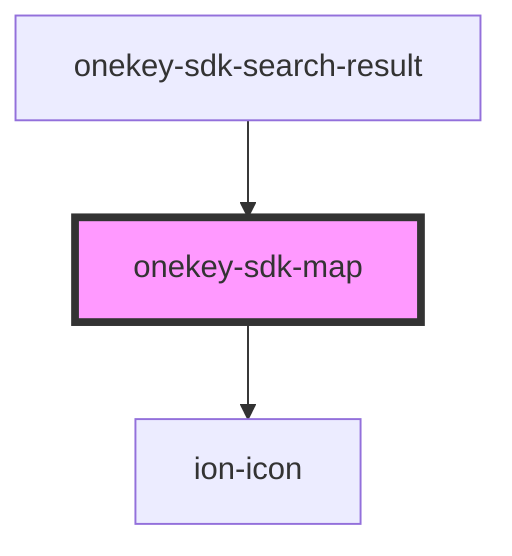

# onekey-sdk-map

<!-- Auto Generated Below -->

## Properties

| Property              | Attribute               | Description | Type     | Default     |
| --------------------- | ----------------------- | ----------- | -------- | ----------- |
| `defaultZoom`         | `default-zoom`          |             | `number` | `undefined` |
| `locations`           | --                      |             | `any[]`  | `[]`        |
| `mapHeight`           | `map-height`            |             | `string` | `'100%'`    |
| `mapWidth`            | `map-width`             |             | `string` | `'100%'`    |
| `markerIcon`          | `marker-icon`           |             | `string` | `undefined` |
| `selectedLocationIdx` | `selected-location-idx` |             | `number` | `undefined` |

## Events

| Event                | Description | Type               |
| -------------------- | ----------- | ------------------ |
| `markerClick`        |             | `CustomEvent<any>` |
| `setCurrentLocation` |             | `CustomEvent<any>` |

## Dependencies

### Used by

 - [onekey-sdk-search-result](../../screens/onekey-sdk-search-result)

### Depends on

- ion-icon

### Graph

----------------------------------------------

*Built with [StencilJS](https://stenciljs.com/)*
