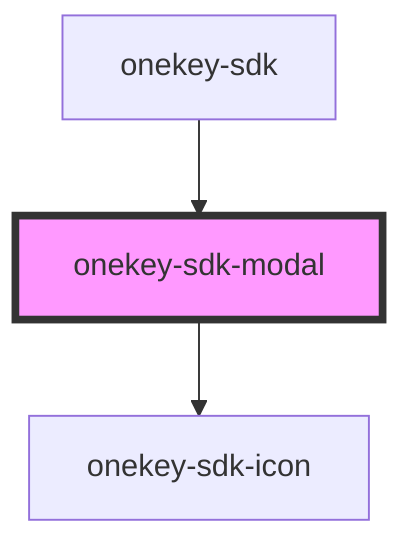

# onekey-sdk-modal

<!-- Auto Generated Below -->

## Properties

| Property | Attribute | Description | Type    | Default     |
| -------- | --------- | ----------- | ------- | ----------- |
| `modal`  | --        |             | `Modal` | `undefined` |

## Dependencies

### Used by

 - [onekey-sdk](../../screens/onekey-sdk)

### Depends on

- [onekey-sdk-icon](../onekey-sdk-icon)

### Graph

----------------------------------------------

*Built with [StencilJS](https://stenciljs.com/)*
