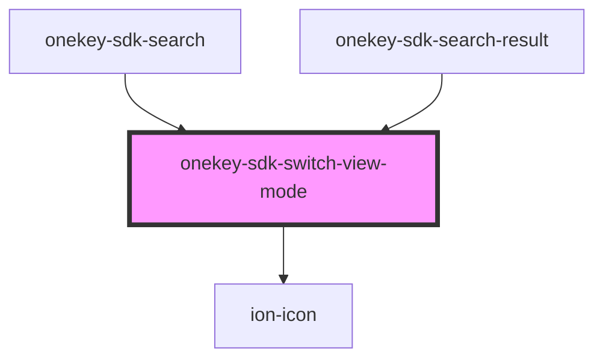

# onekey-sdk-switch-view-mode

<!-- Auto Generated Below -->

## Properties

| Property      | Attribute       | Description | Type                              | Default  |
| ------------- | --------------- | ----------- | --------------------------------- | -------- |
| `typeOfLabel` | `type-of-label` |             | `"disabled" \| "full" \| "short"` | `'full'` |

## Events

| Event            | Description | Type               |
| ---------------- | ----------- | ------------------ |
| `switchViewMode` |             | `CustomEvent<any>` |

## Dependencies

### Used by

 - [onekey-sdk-search](../../screens/onekey-sdk-search)
 - [onekey-sdk-search-result](../../screens/onekey-sdk-search-result)

### Depends on

- ion-icon

### Graph

----------------------------------------------

*Built with [StencilJS](https://stenciljs.com/)*
