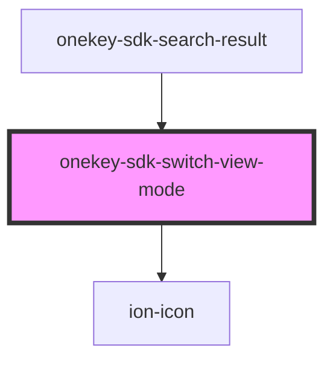

# onekey-sdk-switch-view-mode

<!-- Auto Generated Below -->

## Events

| Event            | Description | Type               |
| ---------------- | ----------- | ------------------ |
| `switchViewMode` |             | `CustomEvent<any>` |

## Dependencies

### Used by

 - [onekey-sdk-search-result](../../screens/onekey-sdk-search-result)

### Depends on

- ion-icon

### Graph

----------------------------------------------

*Built with [StencilJS](https://stenciljs.com/)*
