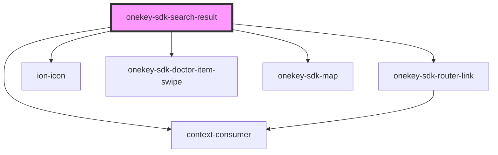

# onekey-sdk-search-doctor

<!-- Auto Generated Below -->

## Properties

| Property   | Attribute | Description | Type                      | Default     |
| ---------- | --------- | ----------- | ------------------------- | ----------- |
| `setStore` | --        |             | `(a: StoreProps) => void` | `undefined` |
| `store`    | --        |             | `StoreProps`              | `undefined` |

## Dependencies

### Depends on

- [onekey-sdk-router-link](../../onekey-sdk-router/onekey-sdk-router-link)
- ion-icon
- [onekey-sdk-doctor-item-swipe](../../ui-kits/onekey-sdk-doctor-item-swipe)
- [onekey-sdk-map](../../ui-kits/onekey-sdk-map)
- context-consumer

### Graph

----------------------------------------------

*Built with [StencilJS](https://stenciljs.com/)*
