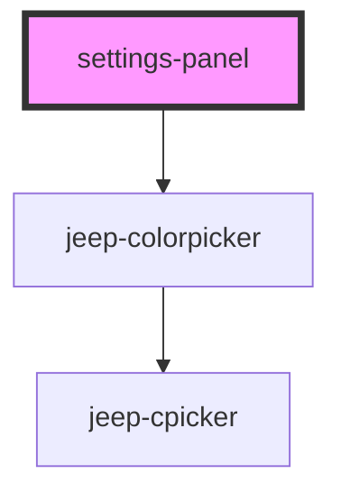

# my-component

<!-- Auto Generated Below -->

## Events

| Event          | Description | Type               |
| -------------- | ----------- | ------------------ |
| `applyChanges` |             | `CustomEvent<any>` |
| `backPressed`  |             | `CustomEvent<any>` |

## Dependencies

### Depends on

- jeep-colorpicker

### Graph

----------------------------------------------

*Built with [StencilJS](https://stenciljs.com/)*
