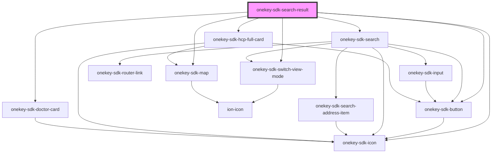

# onekey-sdk-search-doctor

<!-- Auto Generated Below -->

## Dependencies

### Depends on

- [onekey-sdk-button](../../ui-kits/onekey-sdk-button)
- [onekey-sdk-switch-view-mode](../../ui-kits/onekey-sdk-switch-view-mode)
- [onekey-sdk-icon](../../ui-kits/onekey-sdk-icon)
- [onekey-sdk-search](../onekey-sdk-search)
- [onekey-sdk-hcp-full-card](../../ui-kits/onekey-sdk-hcp-full-card)
- [onekey-sdk-doctor-card](../../ui-kits/onekey-sdk-doctor-card)
- [onekey-sdk-map](../../ui-kits/onekey-sdk-map)

### Graph

----------------------------------------------

*Built with [StencilJS](https://stenciljs.com/)*
