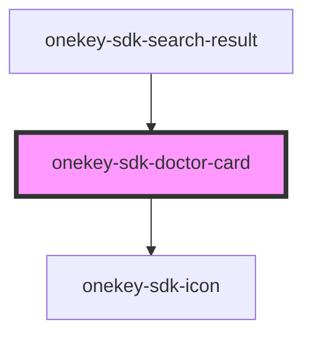

# onekey-sdk-doctor-card

<!-- Auto Generated Below -->

## Properties

| Property           | Attribute           | Description | Type      | Default     |
| ------------------ | ------------------- | ----------- | --------- | ----------- |
| `address`          | `address`           |             | `string`  | `undefined` |
| `distance`         | `distance`          |             | `string`  | `undefined` |
| `name`             | `name`              |             | `string`  | `undefined` |
| `professionalType` | `professional-type` |             | `string`  | `undefined` |
| `selected`         | `selected`          |             | `boolean` | `undefined` |
| `viewMode`         | `view-mode`         |             | `string`  | `undefined` |

## Dependencies

### Used by

 - [onekey-sdk-search-result](../../screens/onekey-sdk-search-result)

### Depends on

- [onekey-sdk-icon](../onekey-sdk-icon)

### Graph

----------------------------------------------

*Built with [StencilJS](https://stenciljs.com/)*
