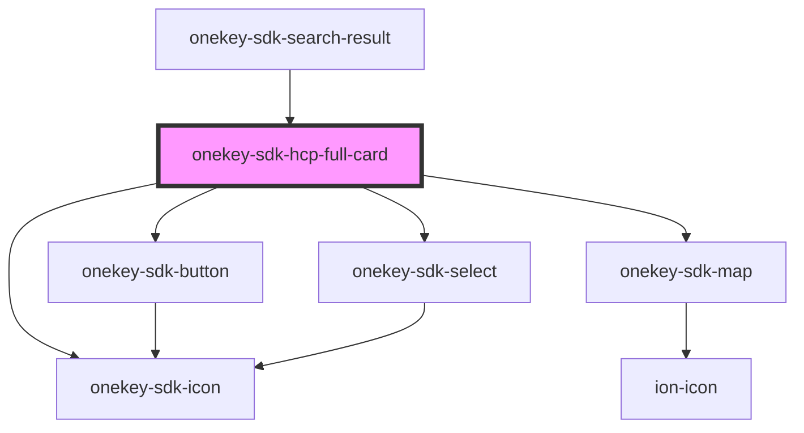

# onekey-sdk-hcp-full-card

<!-- Auto Generated Below -->

## Events

| Event                 | Description | Type                      |
| --------------------- | ----------- | ------------------------- |
| `backFromHcpFullCard` |             | `CustomEvent<MouseEvent>` |

## Dependencies

### Used by

 - [onekey-sdk-search-result](../../screens/onekey-sdk-search-result)

### Depends on

- [onekey-sdk-button](../onekey-sdk-button)
- [onekey-sdk-icon](../onekey-sdk-icon)
- [onekey-sdk-map](../onekey-sdk-map)
- [onekey-sdk-select](../onekey-sdk-select)

### Graph

----------------------------------------------

*Built with [StencilJS](https://stenciljs.com/)*
