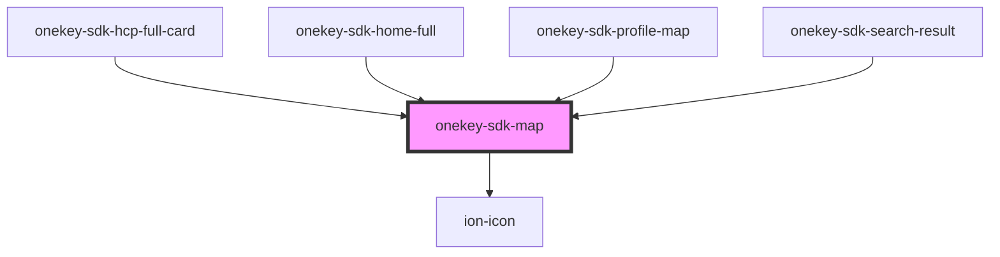

# onekey-sdk-map

<!-- Auto Generated Below -->

## Properties

| Property              | Attribute               | Description | Type                                    | Default     |
| --------------------- | ----------------------- | ----------- | --------------------------------------- | ----------- |
| `breakpoint`          | --                      |             | `Breakpoint`                            | `undefined` |
| `defaultZoom`         | `default-zoom`          |             | `number`                                | `undefined` |
| `dragging`            | `dragging`              |             | `boolean`                               | `true`      |
| `interactive`         | `interactive`           |             | `boolean`                               | `true`      |
| `isForcedZoomToMe`    | `is-forced-zoom-to-me`  |             | `boolean`                               | `false`     |
| `isShowMeMarker`      | `is-show-me-marker`     |             | `boolean`                               | `false`     |
| `locations`           | --                      |             | `any[]`                                 | `[]`        |
| `mapHeight`           | `map-height`            |             | `string`                                | `'100%'`    |
| `mapMinHeight`        | `map-min-height`        |             | `string`                                | `'0px'`     |
| `mapWidth`            | `map-width`             |             | `string`                                | `'100%'`    |
| `markerIcon`          | `marker-icon`           |             | `string`                                | `undefined` |
| `modeView`            | `mode-view`             |             | `ModeViewType.LIST \| ModeViewType.MAP` | `undefined` |
| `noCurrentLocation`   | `no-current-location`   |             | `boolean`                               | `false`     |
| `selectedLocationIdx` | `selected-location-idx` |             | `number`                                | `undefined` |
| `zoomControl`         | `zoom-control`          |             | `boolean`                               | `false`     |

## Events

| Event                | Description | Type               |
| -------------------- | ----------- | ------------------ |
| `mapClicked`         |             | `CustomEvent<any>` |
| `onMapDrag`          |             | `CustomEvent<any>` |
| `onMarkerClick`      |             | `CustomEvent<any>` |
| `setCurrentLocation` |             | `CustomEvent<any>` |

## Dependencies

### Used by

 - [onekey-sdk-hcp-full-card](../onekey-sdk-hcp-full-card)
 - [onekey-sdk-home-full](../../screens/onekey-sdk-home/onekey-sdk-home-full)
 - [onekey-sdk-profile-map](../onekey-sdk-profile-map)
 - [onekey-sdk-search-result](../../screens/onekey-sdk-search-result)

### Depends on

- ion-icon

### Graph

----------------------------------------------

*Built with [StencilJS](https://stenciljs.com/)*
