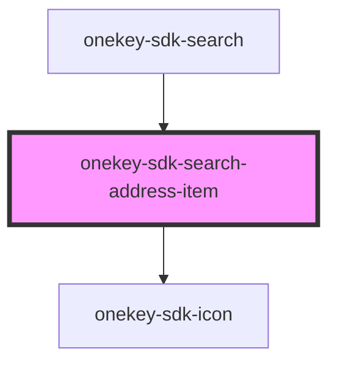

# onekey-sdk-search-address-item

<!-- Auto Generated Below -->

## Properties

| Property            | Attribute             | Description | Type      | Default     |
| ------------------- | --------------------- | ----------- | --------- | ----------- |
| `activated`         | `activated`           |             | `boolean` | `false`     |
| `currentSearchText` | `current-search-text` |             | `string`  | `undefined` |
| `item`              | `item`                |             | `any`     | `undefined` |

## Events

| Event           | Description | Type               |
| --------------- | ----------- | ------------------ |
| `selectAddress` |             | `CustomEvent<any>` |

## Dependencies

### Used by

 - [onekey-sdk-search](../../screens/onekey-sdk-search)

### Depends on

- [onekey-sdk-icon](../onekey-sdk-icon)

### Graph

----------------------------------------------

*Built with [StencilJS](https://stenciljs.com/)*
