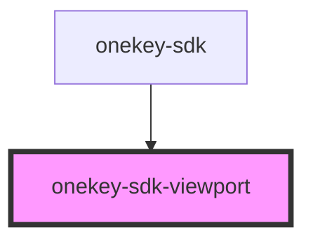

# onekey-sdk-viewport

<!-- Auto Generated Below -->

## Properties

| Property | Attribute | Description | Type       | Default |
| -------- | --------- | ----------- | ---------- | ------- |
| `sizes`  | --        |             | `Object[]` | `[]`    |

## Events

| Event         | Description | Type               |
| ------------- | ----------- | ------------------ |
| `sizeChanged` |             | `CustomEvent<any>` |

## Dependencies

### Used by

 - [onekey-sdk](../../screens/onekey-sdk)

### Graph

----------------------------------------------

*Built with [StencilJS](https://stenciljs.com/)*
