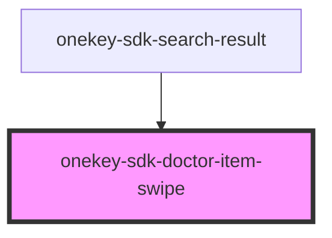
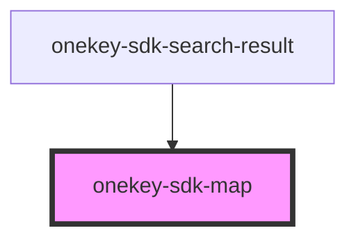

# onekey-sdk-doctor-item-swipe

<!-- Auto Generated Below -->

## Properties

| Property   | Attribute  | Description | Type     | Default     |
| ---------- | ---------- | ----------- | -------- | ----------- |
| `address`  | `address`  |             | `string` | `undefined` |
| `distance` | `distance` |             | `string` | `undefined` |
| `gp`       | `gp`       |             | `string` | `undefined` |
| `name`     | `name`     |             | `string` | `undefined` |

## Dependencies

### Used by

 - [onekey-sdk-search-result](../../screens/onekey-sdk-search-result)

### Graph

----------------------------------------------

*Built with [StencilJS](https://stenciljs.com/)*
     |
| `mapLink`                   | `map-link`                     |                       | `string` | `'<a href="http://openstreetmap.org">OpenStreetMap</a>'` |
| `mapTileLayer`              | `map-tile-layer`               |                       | `string` | `'http://a.tile.openstreetmap.fr/hot/{z}/{x}/{y}.png'`   |
| `mapWidth`                  | `map-width`                    |                       | `string` | `'100%'`                                                 |
| `markerIcon`                | `marker-icon`                  |                       | `string` | `undefined`                                              |
| `markerIconCurrentLocation` | `marker-icon-current-location` |                       | `string` | `undefined`                                              |
| `selectedLocationIdx`       | `selected-location-idx`        |                       | `number` | `0`                                                      |

## Dependencies

### Used by

 - [onekey-sdk-search-result](../../screens/onekey-sdk-search-result)

### Graph

----------------------------------------------

*Built with [StencilJS](https://stenciljs.com/)*
