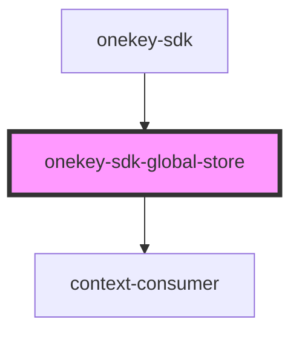

# onekey-sdk-global-store

<!-- Auto Generated Below -->

## Properties

| Property   | Attribute | Description | Type         | Default      |
| ---------- | --------- | ----------- | ------------ | ------------ |
| `renderer` | --        |             | `Function`   | `() => null` |
| `store`    | --        |             | `StoreProps` | `{}`         |

## Dependencies

### Used by

 - [onekey-sdk](../screens/onekey-sdk)

### Depends on

- context-consumer

### Graph

----------------------------------------------

*Built with [StencilJS](https://stenciljs.com/)*
